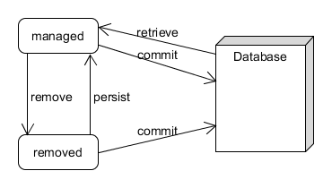

# Lifecycle

JPA entities go through a series of states as they are modified.

## States

| State | Description |
| :--- | :--- |
| New | Doesn't exist in the DB as is not handled by the entity manager |
| Managed | Persisted into DB and handled by the entity manager |
| Detached | Removed from the entity manager, but still persisted in the DB |
| Removed | Deleted from the DB |

Only the managed and removed states interact directly with the database. This requires an open transaction to work.

## Callback Methods

There is a series of annotations, such as @PrePersist or @PostLoad, which can be used to interact with persistence events through callback methods.

These can be useful for auditing or initializing values.

## More Information

* [Managed Entity Objects](https://www.objectdb.com/java/jpa/persistence/managed)

