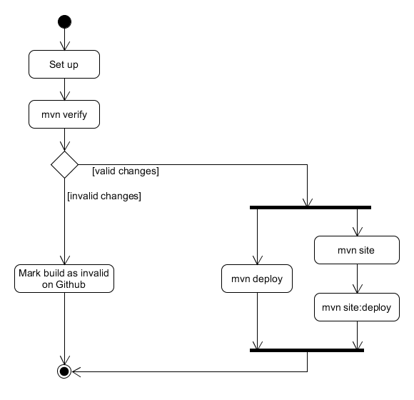

# Continuous Integration



It is easy to integrate Maven with a CI project. Take advantage of profiles and Maven phases, and use a settings file for sensitive information.

The recommended steps are:

* Running tests up to the verify phase
* If that works deploy artifacts using Maven

## Settings file

Sensitive information, such authentication data for servers, should be stored inside a Maven settings file in a protected folder.

## Profiles

### Deployment Profiles

Three profiles are used when deploying artifacts:

* A generic deployment profile
* A development deployment profile
* A releases deployment profile

These contain a small amount of configuration, which can be extended to add anything the project may need during deployment.

The generic generic deployment profile just disables the test:

```markup
<profile>
   <!-- Deployment profile -->
   <!-- Sets ups the environment for deployment -->
   <id>deployment</id>
   <properties>
      <!-- Tests are skipped -->
      <maven.test.skip>true</maven.test.skip>
   </properties>
</profile>
```

Development deployment sets the development site deployment:

```markup
<profile>
   <!-- Development site deployment profile -->
   <!-- Sets the site repository to point to the development repo -->
   <id>deployment-development</id>
   <distributionManagement>
      <site>
         <id>site-development</id>
         <name>Project Development Documentation Site</name>
         <!-- The URL should be set externally -->
         <url>${site.develop.url}</url>
      </site>
   </distributionManagement>
</profile>
```

Release deployment sets the release site deployment:

```markup
<profile>
   <!-- Release site deployment profile -->
   <!-- Sets the site repository to point to the releases repo -->
   <id>deployment-release</id>
   <activation>
      <!-- Active by default so the repository appears in the reports -->
      <activeByDefault>true</activeByDefault>
   </activation>
   <distributionManagement>
      <site>
         <id>site</id>
         <name>Project Documentation Site</name>
         <!-- The URL should be set externally -->
         <url>${site.release.url}</url>
      </site>
   </distributionManagement>
</profile>
```

The site URLs properties should be defined out of the POM, inside a Maven settings file, along the sites authentication data.

## Scripts

There is a [CI script](https://github.com/Bernardo-MG/ci-shell-scripts) for setting up a Maven settings file:

```yaml
before_script:
  # Creates Maven settings
  - ~/.scripts/java/maven/create-maven-settings.sh $VERSION_TYPE
```

This will set up the credentials for deploying the artifacts, both the JAR/WAR and the Maven site, from environmental variables.

